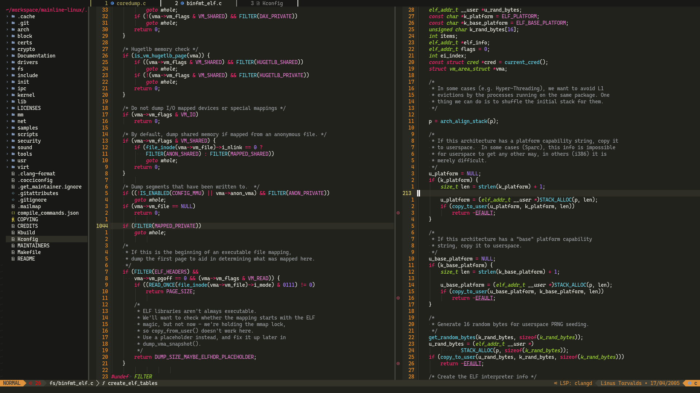

# เรียนรู้ [Neovim (nvim)](https://github.com/neovim/neovim)

---

# จริงๆแล้ว Neovim(vim) คืออะไร?

Neovim คือ PDE(Personalized development environment) หรือ IDE บน commandlind ถูก folk มาจาก vim โดยมีการเชื่อมต่อกับ LSP client และ luat api สําหรับการกําหนดค่าและการสร้าง plugin.
เพื่อช่วยในการเชื่อมต่อกับ lua.nvim มีชุมชนที่หลากหลาย [plugin ecosystem](https://github.com/rockerBOO/awesome-neovim) ซึ่งช่วยให้เราออกแบบได้ถูกต้อง,ทนทาน, ขยายและเปลี่ยนแปลงได้

## ฉันรู้จัก vim แล้วต้องการเรียนรู้ nvim

เยี่ยม คุณสามารถข้าม steps ไปได้ครึ่งนึง :) \
อ่าน [Chapter 8 - Personal Config vs Preconfigured Configuration](https://ofirgall.github.io/learn-nvim/chapters/08-advanced-config.html#personal-config-vs-preconfigured-configuration) กลับไปยัง [Chapter 2](https://ofirgall.github.io/learn-nvim/chapters/02-basic-config.md) แล้วข้ามไปยัง [Chapter 8 - Basic Lua](https://ofirgall.github.io/learn-nvim/chapters/08-advanced-config.html#basic-lua).

# ทำไมฉันถึงเขียนไกด์นี้?

ฉันเริ่มใช้ nvim เมื่อต้น 2022 หลังจากใช้ sublime มา 6 ปี,ฉันรู้สึกว่า sublime ในส่วนของ plugin ค่อนข้างล้าหลัง ซึ่งเมื่อเทียบกันกับ feature ที่ VSCode,ฉันพยายามใช้งาน VSCode อยู่ซักอาทิตย์นึงแล้วได้เข้าใจว่ามันไม่ค่อยเหมาะกับฉัน, ฉันรู้สึกว่ามันบังคับให้ฉันใช้เม้าส์บ่อยเกินไป.ฉันเลยตัดสินใจมาลอง nvim ซึ่งเป็นการตัดสินใจที่ดีที่สุด.

ฉันไม่รู้จะเริ่มต้นยังไง,ควรต้องเรียนรู้ vim ก่อนไหม? จะทำการคอนฟิก nvim ยังไง? แล้วปลั๊กอินจากอันไหนที่เยอะมากมายที่ฉันต้องลง?

ฉันต้องการสร้างไกด์เครอบคลุมการใช้งานพื้นฐานของ vim,ให้ tools ที่ใช้ในการเรียนรู้ vim(ให้เบ็ดตกปลา แทนที่ปลา), และอีกอันคือช่วยคุณในการกำหนดค่า nvim.

---

# หนังสือ

ถ้าคุณอ่านแล้วเจอข้อผิดพลาดสามารถสร้าง issues ได้ที่ [socool/learn-nvim](https://github.com/socool/learn-nvim) หรือ สร้าง PR มาเป็น contributor ด้วยกัน

## [เริ่มอ่านได้ตรงนี้](https://socool.github.io/learn-nvim/)

- Project folk มาจาก https://github.com/ofirgall/learn-nvim
